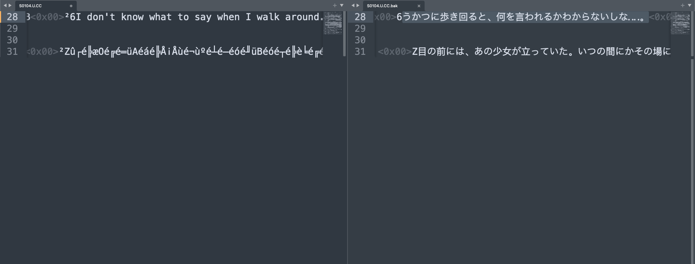

## Tools

I've found that the file format of this game is a combination of DOS format and Japanese SHIFT-JIS, 
which is expected for the games of this era.

Using an editor like Sublime Text one can see the extracted files ex: 'S0104.U.CC' and understand
better the underlyings.

This can be done by:
   Installing the plugin ConvertToUTF8 and Codecs33
   Opening the file
   Reopen with encoding > DOS (CP 437)
   Reload with encoding > Shift-JIS

## File structure

For some reason, some of the original files are duplicates, with extra dialogs at the end.
Example of this are:

    S00.U.CC
    S00B.U.CC
    S00C.U.CC

